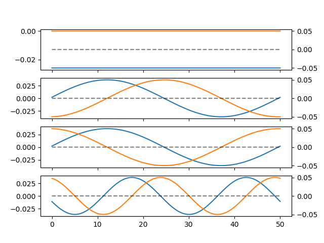
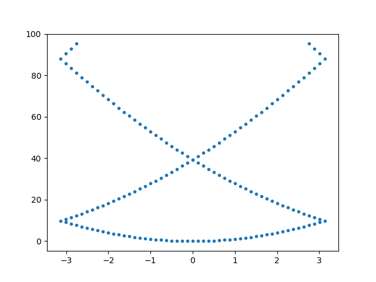
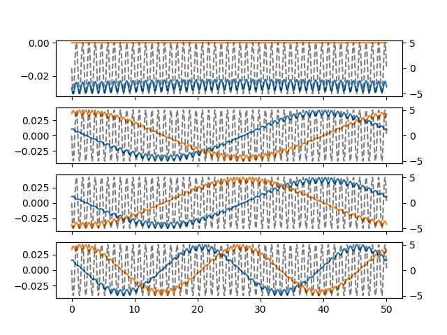
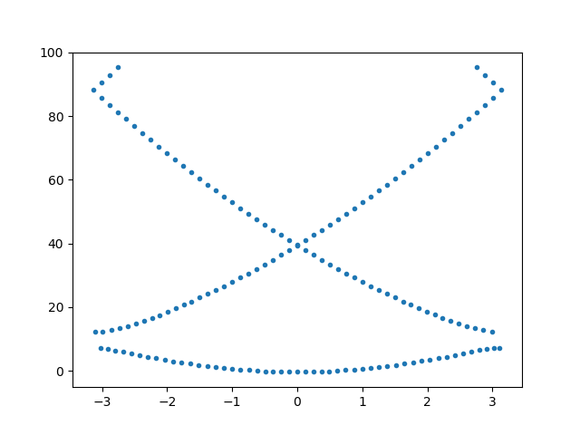
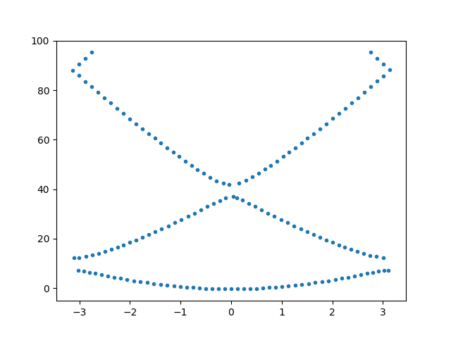
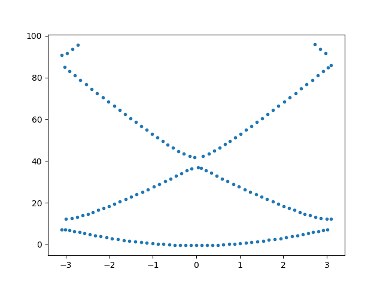

# bloch_waves
An exploration of the wave functions of particles in periodic boundary conditions.

Given a periodic potential with a period a,

we get a hamiltonian which commutes with the discrete transelation operator

,

and they thus have a common set of eigenvectors, 

This is Blochs theorem. 

First, we have free waves with the periodic boundary condition,

.

.

The eigenvalues, as a function of k, forms a parabola (For low values. High values will have deviacies from the errors in finite difference.) If we plot this insed the first brillouin zone, we get:

Adding a periodic disturbance, 

we get a bloch function

and a band gap

 

Continuing to add more frequencies

give more gaps

Equation from [codecogs](https://www.codecogs.com/latex/eqneditor.php)
